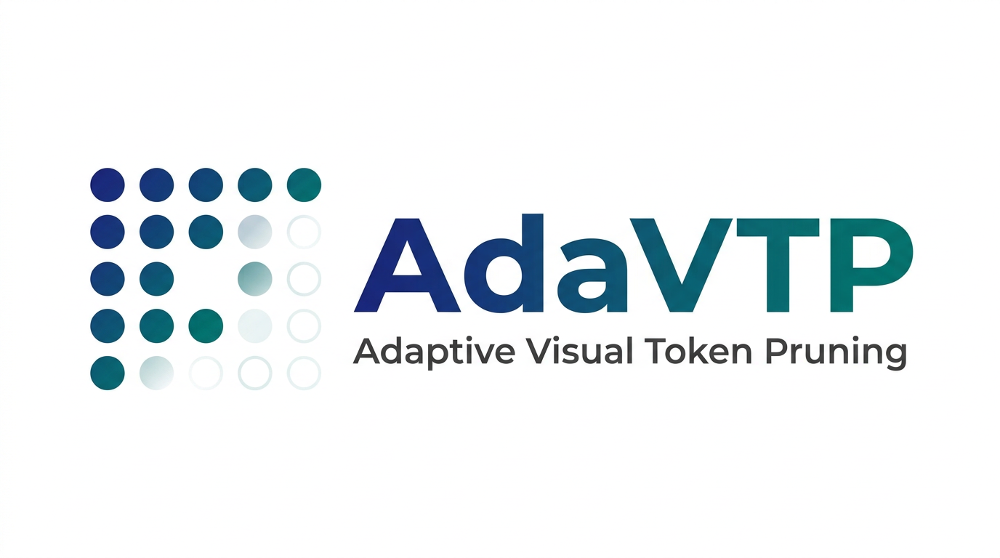

<div align="center">


# AdaVTP: Adaptive Visual Token Pruning for Efficient Vision-Language Models

[](https://openreview.net/forum?id=kcBm2EUnLP&referrer=%5BAuthor%20Console%5D(%2Fgroup%3Fid%3Dacmmm.org%2FACMMM%2F2026%2FConference%2FAuthors%23your-submissions))
[](LICENSE)
[](https://www.python.org/downloads/release/python-3100/)
[](https://pytorch.org/)

A simple yet effective visual token pruning module adaptively guided by input text semantics, achieving Pareto-optimal trade-offs between computational efficiency and model performance.

</div>

---

## Overview

**AdaVTP** formulates visual token pruning as an information bottleneck optimization problem conditioned on input text, and learns to retain an optimal minimal subset of visual tokens through information bottleneck regularization, feature fidelity constraints, and cross-entropy supervision. When retaining only **64 tokens**, AdaVTP achieves **95.7%** performance retention (vs. VisionZip's 94.0%), and reduces prefill latency from 136 ms to 55 ms (**2.5x** speedup).

This repository provides AdaVTP implementations on two VLM backbones:

| Backbone | Directory |
|:--|:--|
| [LLaVA-v1.5-7B](https://huggingface.co/liuhaotian/llava-v1.5-7b) | `AVA-llava_v1.5_main/` |
| [Qwen2.5-VL-3B-Instruct](https://huggingface.co/Qwen/Qwen2.5-VL-3B-Instruct) | `AVA-qwen2_5_vl_main/` |

## Table of Contents

- [Environment Setup](#environment-setup)
- [Data & Model Preparation](#data--model-preparation)
- [Training](#training)
- [Evaluation](#evaluation)
- [Project Structure](#project-structure)
- [Citation](#citation)
- [Acknowledgements](#acknowledgements)

---

## Environment Setup

We provide a conda environment file for easy setup:

```bash
conda env create -f environment.yml
conda activate qwen
```

Key dependencies: Python 3.10, PyTorch 2.5+, Transformers 4.57+, Accelerate, Flash-Attention.

---

## Data & Model Preparation

### Training Data

We use the LLaVA-v1.5 665K mixture dataset for training. Please follow the [LLaVA Visual Instruction Tuning](https://github.com/haotian-liu/LLaVA?tab=readme-ov-file#visual-instruction-tuning) instructions to download the images from the constituting datasets:

- **COCO**: [train2017](http://images.cocodataset.org/zips/train2017.zip)
- **GQA**: [images](https://downloads.cs.stanford.edu/nlp/data/gqa/images.zip)
- **OCR-VQA**: [download script](https://drive.google.com/drive/folders/1_GYPY5UkUy7HIcR0zq3ZCFgeZN7BAfm_?usp=sharing)
- **TextVQA**: [train_val_images](https://dl.fbaipublicfiles.com/textvqa/images/train_val_images.zip)
- **VisualGenome**: [part1](https://cs.stanford.edu/people/rak248/VG_100K_2/images.zip), [part2](https://cs.stanford.edu/people/rak248/VG_100K_2/images2.zip)

We provide the pre-processed training annotation file:

```
llava_v1_5_mix665k_new_with_images_short_1_1.json
```

> **Note**: After downloading the images, you need to update the image paths in this JSON file to match your local directory structure.

### Pre-trained Models

Please download the following models from Hugging Face:

| Model | Link | Usage |
|:--|:--|:--|
| LLaVA-v1.5-7B | [liuhaotian/llava-v1.5-7b](https://huggingface.co/liuhaotian/llava-v1.5-7b) | LLaVA backbone |
| Qwen2.5-VL-3B-Instruct | [Qwen/Qwen2.5-VL-3B-Instruct](https://huggingface.co/Qwen/Qwen2.5-VL-3B-Instruct) | Qwen2.5-VL backbone |
| CLIP ViT-L/14@336px | [openai/clip-vit-large-patch14-336](https://huggingface.co/openai/clip-vit-large-patch14-336) | Vision encoder (for LLaVA) |

---

## Training

The main training entry points are:

- **LLaVA-v1.5**: `AVA-llava_v1.5_main/trainer/train_finetune.py`
- **Qwen2.5-VL**: `AVA-qwen2_5_vl_main/trainer/train_finetune.py`

Configure the data path, model path, and output directory, then launch training. Our code supports **multi-GPU distributed training** via `torch.distributed`.

### Training on LLaVA-v1.5-7B

```bash
cd AVA-llava_v1.5_main/trainer

python -m torch.distributed.run --nproc_per_node=3 --master_port=29502 train_finetune.py \
    --name v1-298M-data-epoch-3 \
    --learning_rate 3e-5 \
    --batch_size 4 \
    --epochs 30 \
    --save_weight v1-298M-data-epoch-3 \
    --save_interval 1000 \
    --wandb_project LLaVA-Main \
    --from_resume 1 \
    --data_path /path/to/llava_v1_5_mix665k_new_with_images_short_1_1.json
```

### Training on Qwen2.5-VL-3B

```bash
cd AVA-qwen2_5_vl_main/trainer

python -m torch.distributed.run --nproc_per_node=8 train_finetune.py \
    --name v1-298M-data-epoch-3-3e-5 \
    --learning_rate 3e-5 \
    --batch_size 4 \
    --epochs 3 \
    --save_weight v1-298M-data-epoch-3-3e-5 \
    --save_interval 1000 \
    --wandb_project Qwen2.5-VL-Main \
    --from_resume 1 \
    --data_path /path/to/llava_v1_5_mix665k_new_with_images_short_1_1.json
```

> Adjust `--nproc_per_node` according to your available GPUs.

---

## Evaluation

We adopt the same evaluation benchmarks as LLaVA-v1.5. Please download the benchmark data by following the [LLaVA Evaluation Guide](https://github.com/haotian-liu/LLaVA/blob/main/docs/Evaluation.md).

Supported benchmarks include: **MME**, **TextVQA**, **GQA**, **POPE**, **SEED-Bench**, **MMBench**, **VQAv2**, **MMMU**, and more.

### Example: Evaluating on MME

**Step 1**: Run inference to generate answers.

```bash
cd AVA-llava_v1.5_main/evaluation

python -m torch.distributed.run --nproc_per_node=2 --master_port=29502 eval_benchmarks.py \
    --question_file /path/to/eval/MME/llava_mme.jsonl \
    --image_folder /path/to/eval/MME/MME_Benchmark_release_version/MME_Benchmark \
    --answer_file /path/to/output/MME/answers/v1-298M-data-epoch-3.jsonl \
    --from_weight v1-298M-data-epoch-3 \
    --train_drop_rate 0.67
```

**Step 2**: Convert answers to MME format.

```bash
cd evaluation/playground/data/eval/MME
python convert_answer_to_mme.py --experiment v1-298M-data-epoch-3
```

**Step 3**: Calculate scores.

```bash
cd evaluation/playground/data/eval/MME/eval_tool
python calculation.py --results_dir answers/v1-298M-data-epoch-3
```

---

## Project Structure

```
AdaVTP/
├── assets/                         # Logo and images
├── environment.yml                 # Conda environment
├── llava_v1_5_mix665k_...json      # Training annotations
│
├── AVA-llava_v1.5_main/            # AdaVTP on LLaVA-v1.5-7B
│   ├── llava_v1_5/                 #   Modified LLaVA model with AdaVTP
│   │   ├── modeling_llava.py
│   │   ├── adaptor.py              #   AdaVTP pruning module
│   │   ├── clip_encoder.py
│   │   └── ...
│   ├── dataset/                    #   Data loading & processing
│   ├── trainer/                    #   Training scripts
│   │   ├── train_finetune.py
│   │   └── trainer_utils.py
│   └── evaluation/                 #   Evaluation scripts & benchmarks
│       ├── eval_benchmarks.py
│       └── playground/data/eval/
│
└── AVA-qwen2_5_vl_main/           # AdaVTP on Qwen2.5-VL-3B
    ├── qwen2_5vl/                  #   Modified Qwen2.5-VL model with AdaVTP
    │   ├── qwen2_5_vl.py
    │   ├── vision_encoder.py
    │   └── ...
    ├── dataset/                    #   Data loading & processing
    ├── trainer/                    #   Training scripts
    │   ├── train_finetune.py
    │   └── trainer_utils.py
    └── evaluation/                 #   Evaluation scripts & benchmarks
        ├── eval_benchmarks.py
        └── playground/data/eval/
```

---

## Citation

If you find AdaVTP useful in your research, please consider citing:

```bibtex
@article{adavtp2026,
  title={AdaVTP: Adaptive Visual Token Pruning for Efficient Vision-Language Models},
  author={},
  journal={},
  year={2026}
}
```

---

## Acknowledgements

This project builds upon the following excellent open-source works:

- [LLaVA](https://github.com/haotian-liu/LLaVA) - Visual Instruction Tuning
- [Qwen2.5-VL](https://github.com/QwenLM/Qwen2.5-VL) - Qwen Vision-Language Model
- [CLIP](https://github.com/openai/CLIP) - Contrastive Language-Image Pretraining

---

<div align="center">
<i>If you have any questions, please open an issue or contact us.</i>
</div>
